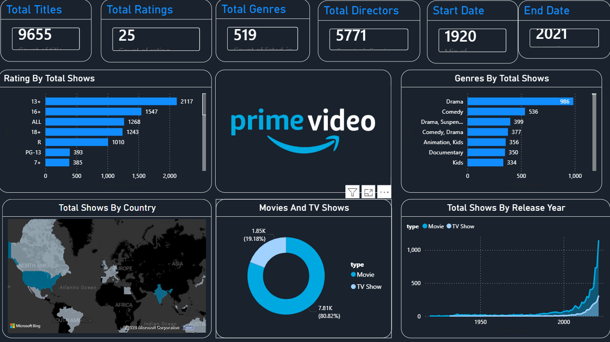

# Amazon Prime Video Data Analysis using Power BI




## Project Overview

This project analyzes the **Amazon Prime Video dataset** to extract meaningful insights and trends. Using **Microsoft Power BI**, the dataset is transformed into an **interactive and visually appealing dashboard** highlighting:

- Content distribution across Movies and TV Shows  
- Popular genres and trends  
- Ratings classification  
- Country-wise availability  
- Historical release patterns (1920–2021)  

The goal is to provide **clear insights for analysts, content creators, and users**.

---

## Problem Statement

Streaming platforms host **thousands of movies and TV shows** across genres, ratings, and countries. As datasets grow, analyzing patterns using raw data becomes difficult.  

**Challenges:**

- Identifying popular genres and content types  
- Analyzing ratings and audience classification  
- Understanding country-wise content availability  
- Observing release trends over decades  

**Goal:** Build a **visual and interactive solution** to simplify analysis and provide actionable insights.

---

## Proposed Solution

The solution involves analyzing the Amazon Prime Video dataset and creating a **Power BI dashboard** that allows users to:

- Explore content by **genre, type, rating, and country**  
- Understand **release year trends**  
- Gain insights through **interactive charts, maps, and graphs**  

This ensures **fast, accurate, and user-friendly data interpretation**.

---

## System Approach

### System Requirements

- **Operating System:** Windows 10 or above  
- **RAM:** Minimum 4 GB  
- **Software:** Microsoft Power BI Desktop  

### Dataset Details

| Attribute      | Description                                |
|----------------|--------------------------------------------|
| Title          | Name of the Movie or TV Show               |
| Genre          | Content Genre                              |
| Director       | Director Name                              |
| Country        | Country of Availability                    |
| Rating         | Audience Rating (e.g., PG, R)             |
| Release Year   | Year of Release                            |
| Type           | Movie / TV Show                            |

**Dataset File:** `Dataset/amazon_prime_titles.csv`

### Tools Used

- **Microsoft Power BI Desktop** – Data visualization and dashboard creation  
- **Excel / CSV preprocessing tools** – For cleaning raw data  
- **Data visualization techniques** – Charts, bar plots, maps, and interactive filters  

---

## Algorithm / Workflow

1. **Data Import:** Load `amazon_prime_titles.csv`.  
2. **Data Cleaning:** Remove duplicates, handle missing values, and standardize formats.  
3. **Data Analysis:** Examine key attributes – genre, rating, country, release year.  
4. **Visualization:** Create charts, graphs, and maps for insightful representation.  
5. **Dashboard Creation:** Combine visualizations into an **interactive Power BI dashboard**.  
6. **Insight Generation:** Highlight trends, patterns, and recommendations.  

---

## Results

The dashboard provides insights such as:

- **Movies vs TV Shows distribution**  
- **Genre popularity** (Top genres: Drama, Comedy, Action)  
- **Ratings analysis** (PG, PG-13, R, etc.)  
- **Country-wise content availability**  
- **Release trends over decades** (1920–2021)  


📊 The dashboard allows **dynamic filtering by country, genre, type, and year** for deeper exploration.

---

## Future Scope

- Integration with **Netflix, Disney+, and other streaming platform datasets**  
- **Advanced analytics** – sentiment analysis, recommendation system integration  
- **Real-time dashboard updates** using streaming data  
- Enhanced interactivity – drill-downs, hover effects, KPI highlights  
- Incorporation of **AI & Machine Learning** for predictive content trends  

---

## Repository Structure

```text
Amazon-Prime-Video-Data-Analysis/
├── Dataset/
│   └── amazon_prime_titles.csv        # Original dataset from Google Drive
├── Images/
│   ├── Prime video logo.png           # Logo/banner image
│   └── dashboard_screenshot.png      # Screenshot of analysis
└── README.md                          # Project documentation
